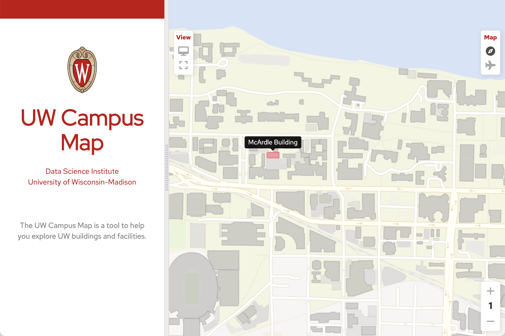

  

    
  

# Campus Map

The campus map is a an interactive web-based mapping application that allows exploration of the campus at the University of Wisconsin-Madison.

## Requirements

### 1. PHP 8.0+

The campus map uses Laravel9 which relies upon PHP 8.0 or later. 

### 2. Web Server

This map application requires Apache or another similar web server.

### 2. SQL Database

The campus map uses SQL for storing building information.

- Campus map server

## Installation

Instructions coming soon.

<!-- LICENSE -->
## License

Distributed under the MIT License. See `LICENSE` for more information.

<!-- CONTACT -->
## Contact

Abe Megahed - (mailto:amegahed@wisc.edu) - email

Project Link: [https://github.com/AFIDSI/campus-map](https://github.com/AFIDSI/campus-map)
